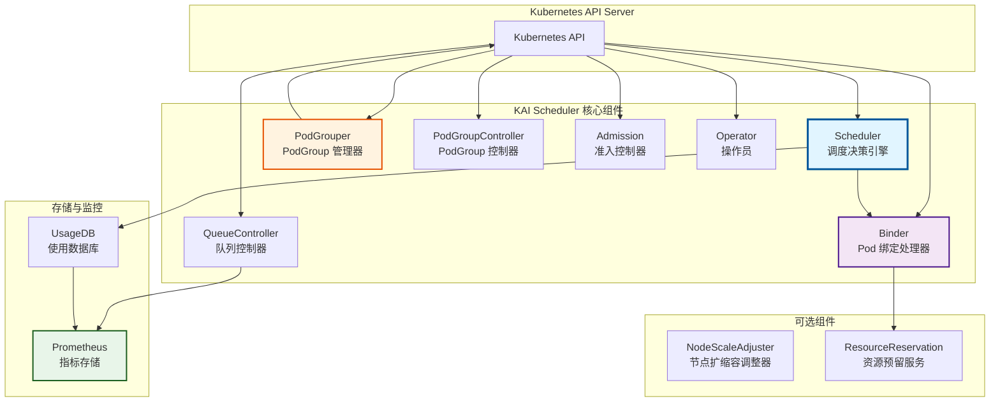
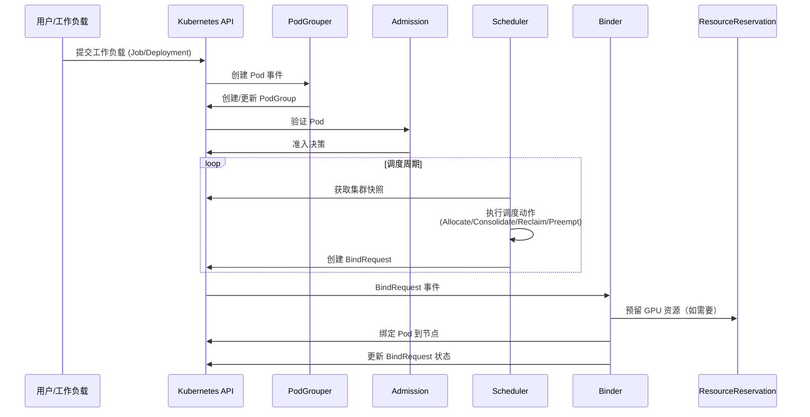
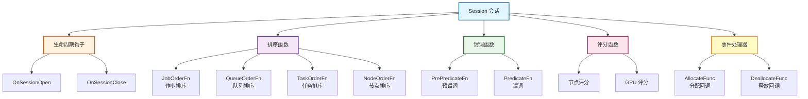
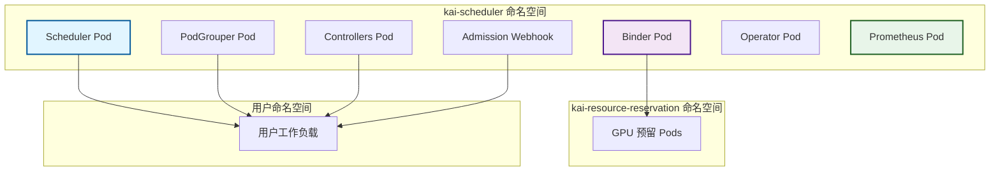

# KAI Scheduler 项目概览与架构分析

## 1. 项目简介

KAI Scheduler 是由 NVIDIA 开发的一个强大、高效、可扩展的 Kubernetes 调度器，专门针对 AI 和机器学习工作负载优化 GPU 资源分配。该项目基于 kube-batch 构建，旨在管理大规模 GPU 集群（包括数千个节点）和高吞吐量的工作负载。

### 核心特性
- **批量调度（Gang Scheduling）**：确保一组 Pod 同时调度或完全不调度
- **Bin Packing 与分散调度**：优化节点使用，最小化碎片或提高弹性
- **工作负载优先级**：在队列内有效地优先处理工作负载
- **层级队列**：支持两级队列层次结构，灵活的组织控制
- **资源分配**：自定义配额、超配额权重、限制和优先级
- **公平性策略**：使用 DRF（主导资源公平性）和资源回收确保公平分配
- **工作负载整合**：智能重新分配运行中的工作负载以减少碎片
- **弹性工作负载**：在定义的最小和最大 Pod 数量内动态扩展
- **GPU 共享**：允许多个工作负载高效共享单个或多个 GPU
- **拓扑感知调度**：根据物理拓扑优化 Pod 放置
- **基于时间的公平共享**：基于历史资源使用情况的公平性

## 2. 整体架构

KAI Scheduler 采用模块化架构，由多个独立但协同工作的组件组成：

### 2.1 核心调度流程

### 2.2 调度周期详解

每个调度周期遵循以下流程：

## 3. 核心概念

### 3.1 PodGroup（Pod 组）
PodGroup 定义了需要一起调度的 Pod 集合，实现 Gang Scheduling：
- **MinMember**：运行 PodGroup 所需的最小成员数
- **Queue**：分配资源的队列
- **PriorityClassName**：优先级类
- **SubGroups**：支持层级结构，实现细粒度的 Gang 调度

### 3.2 Queue（队列）
队列是资源管理的核心原语，提供层级资源分配：
- **Quota（配额）**：保证的资源分配
- **Over-Quota Priority（超配额优先级）**：超过配额时的分配顺序
- **Over-Quota Weight（超配额权重）**：同优先级内的资源分配权重
- **Limit（限制）**：资源消耗的硬上限

### 3.3 Session（会话）
Session 代表单个调度周期的上下文：
- 维护集群快照
- 提供插件回调框架
- 创建 Statement 对象
- 跟踪资源分配和使用

### 3.4 Statement（语句）
Statement 提供类似事务的机制：
- **Checkpoint/Rollback**：创建回滚点
- **Allocate/Evict**：虚拟分配/驱逐 Pod
- **Commit/Discard**：提交或丢弃所有更改

### 3.5 Scenario（场景）
Scenario 表示假设的调度状态，用于评估潜在决策：
- 模拟 "what-if" 放置情况
- 在提交前测试复杂的调度操作
- 验证资源可用性

## 4. 插件架构

KAI Scheduler 使用基于插件的架构，允许通过各种扩展点扩展功能：

### 主要插件类型

1. **Proportion Plugin**：实现公平共享和资源分配
2. **Topology Plugin**：拓扑感知调度
3. **GPU Sharing Plugin**：GPU 共享支持
4. **Elastic Plugin**：弹性工作负载支持
5. **Priority Plugin**：优先级管理
6. **Predicates Plugin**：节点过滤
7. **Dynamic Resources Plugin**：动态资源分配（DRA）

## 5. 技术栈

- **语言**：Go 1.24.4
- **框架**：
  - Kubernetes client-go
  - controller-runtime (sigs.k8s.io/controller-runtime)
  - Gin (Web 框架)
- **监控**：
  - Prometheus
  - Grafana
  - Pyroscope (性能分析)
- **集成**：
  - Kubeflow Training Operator
  - Ray Operator
  - JobSet
  - LeaderWorkerSet (LWS)
  - Knative

## 6. 部署架构

## 7. 与其他调度器的对比

### 7.1 与 Volcano 的对比

| 特性 | KAI Scheduler | Volcano |
|------|---------------|---------|
| **Gang Scheduling** | ✅ 支持，带层级 SubGroups | ✅ 支持 |
| **GPU 共享** | ✅ 支持分数和内存分配 | ✅ 支持 |
| **拓扑感知** | ✅ 多级拓扑，细粒度控制 | ✅ 基础拓扑支持 |
| **公平性算法** | DRF + 基于时间的公平共享 | DRF |
| **弹性工作负载** | ✅ 原生支持 | ⚠️ 有限支持 |
| **层级队列** | 2 级层次 | 多级层次 |
| **资源整合** | ✅ 主动整合 | ❌ 不支持 |
| **Binder 分离** | ✅ 独立 Binder 组件 | ❌ 集成在调度器中 |
| **时间衰减公平性** | ✅ 支持 | ❌ 不支持 |
| **动态资源分配** | ✅ 完整 DRA 支持 | ⚠️ 有限支持 |
| **云原生集成** | Karpenter, 自动扩缩容 | 基础支持 |
| **性能** | 优化用于超大规模（数千节点） | 大规模集群 |

### 7.2 与 Kueue 的对比

| 特性 | KAI Scheduler | Kueue |
|------|---------------|-------|
| **架构** | 完整的调度器替代 | 作业排队系统 |
| **调度决策** | 完整的节点选择和放置 | 准入控制，依赖默认调度器 |
| **Gang Scheduling** | ✅ 原生支持 | ✅ 通过 PodGroup |
| **拓扑感知** | ✅ 高级拓扑支持 | ❌ 不支持 |
| **资源整合** | ✅ 支持 | ❌ 不支持 |
| **GPU 共享** | ✅ 细粒度共享 | ⚠️ 基础支持 |
| **使用场景** | AI/ML 工作负载，GPU 集群 | 通用批处理作业管理 |

### 7.3 与默认 Kubernetes 调度器的对比

| 特性 | KAI Scheduler | 默认调度器 |
|------|---------------|-----------|
| **Gang Scheduling** | ✅ 原生支持 | ❌ 需要额外组件 |
| **队列管理** | ✅ 层级队列 | ❌ 无 |
| **公平性** | ✅ DRF + 时间衰减 | ❌ 无 |
| **GPU 共享** | ✅ 支持 | ❌ 不支持 |
| **资源回收** | ✅ 智能回收 | ❌ 无 |
| **抢占** | ✅ 队列内优先级抢占 | ✅ 基础抢占 |
| **拓扑感知** | ✅ 多级拓扑 | ⚠️ 基础拓扑提示 |

## 8. 适用场景

KAI Scheduler 特别适合以下场景：

1. **大规模 AI/ML 训练**：需要 Gang Scheduling 和 GPU 资源管理
2. **多租户 GPU 集群**：需要公平性和资源配额管理
3. **混合工作负载**：训练、推理、交互式作业共存
4. **资源优化**：需要高资源利用率和碎片整理
5. **拓扑敏感应用**：需要考虑网络拓扑的分布式训练
6. **弹性工作负载**：需要动态扩缩容的应用

## 9. 项目成熟度

- **开源时间**：2025 年初
- **社区活跃度**：活跃开发中，双周社区会议
- **生产就绪**：是，NVIDIA 内部使用
- **文档完善度**：高，包含详细的设计文档和示例
- **测试覆盖**：良好，包含单元测试、集成测试和 E2E 测试
- **版本管理**：遵循语义化版本，提供 LTS 版本

## 10. 总结

KAI Scheduler 是一个专为 AI/ML 工作负载设计的高级 Kubernetes 调度器，提供了：

- **强大的 Gang Scheduling**：支持层级 SubGroups
- **智能资源管理**：公平性、配额、优先级
- **GPU 优化**：共享、拓扑感知、DRA
- **高性能**：支持数千节点的集群
- **可扩展性**：丰富的插件架构
- **生产就绪**：完善的监控、指标和故障处理

相比其他调度器，KAI Scheduler 在 GPU 资源管理、拓扑感知调度和基于时间的公平性方面具有独特优势，是大规模 AI/ML 集群的理想选择。

