# KAI Scheduler 调度能力详解

## 1. 核心调度能力概览

KAI Scheduler 提供了一套完整的调度能力，专门针对 AI/ML 工作负载和 GPU 集群优化：

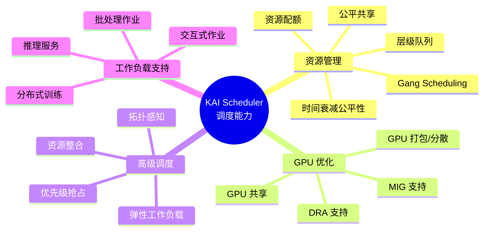

## 2. Gang Scheduling（批量调度）

### 2.1 基本概念

Gang Scheduling 确保一组相关的 Pod 要么全部调度成功，要么全部不调度，避免部分调度导致的资源浪费和死锁。

### 2.2 实现机制

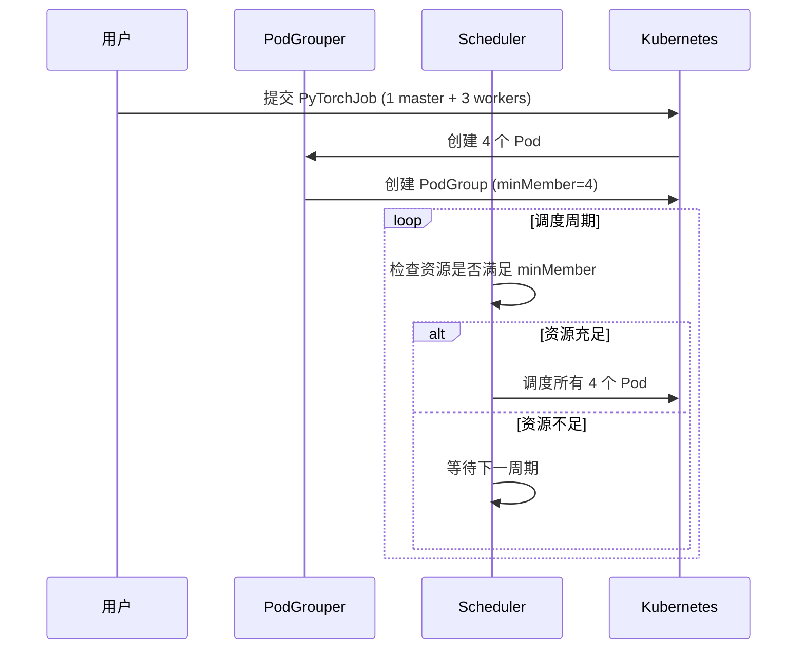

### 2.3 支持的工作负载类型

| 工作负载类型 | Gang 策略 | MinMember 计算 |
|------------|----------|---------------|
| **PyTorchJob** | 强制 Gang | Master + Workers |
| **MPIJob** | 强制 Gang | Launcher + Workers |
| **TensorFlowJob** | 强制 Gang | Chief + Workers + PS |
| **Ray Job** | 可选 Gang | Head + Workers |
| **JobSet** | 可配置 | 根据 startupPolicy |
| **Batch Job** | 默认不 Gang | 1（可配置） |
| **Deployment** | 不 Gang | 每个 Pod 独立 |

### 2.4 层级 Gang Scheduling（SubGroups）

KAI Scheduler 支持层级 SubGroups，实现细粒度的 Gang 调度：

```yaml
apiVersion: scheduling.run.ai/v2alpha2
kind: PodGroup
metadata:
  name: distributed-inference
spec:
  minMember: 2  # 至少需要 2 个 SubGroup
  subGroups:
    - name: decode
      minMember: 2  # decode 需要 2 个子组
    
    - name: decode-workers
      parent: decode
      minMember: 4  # 至少 4 个 worker
    
    - name: decode-leaders
      parent: decode
      minMember: 1  # 至少 1 个 leader
    
    - name: prefill
      minMember: 2
    
    - name: prefill-workers
      parent: prefill
      minMember: 4
    
    - name: prefill-leaders
      parent: prefill
      minMember: 1
```

**层级结构**:
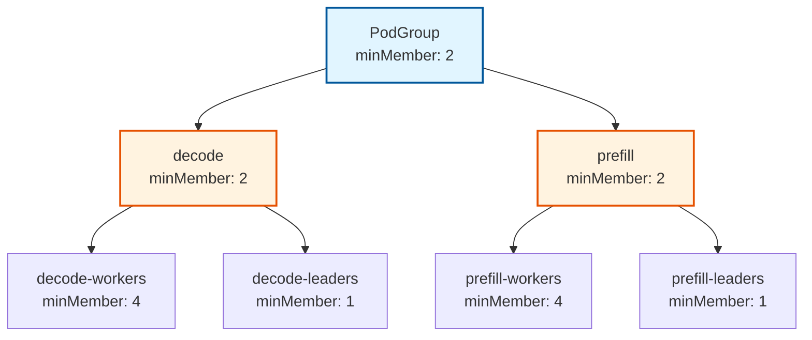

### 2.5 Gang Scheduling 优势

1. **避免死锁**: 防止部分 Pod 占用资源但无法启动
2. **提高效率**: 减少资源浪费
3. **保证一致性**: 确保分布式训练的所有组件同时启动
4. **支持复杂拓扑**: 通过 SubGroups 支持复杂的工作负载结构

## 3. 层级队列与资源管理

### 3.1 队列层次结构

KAI Scheduler 支持两级队列层次：

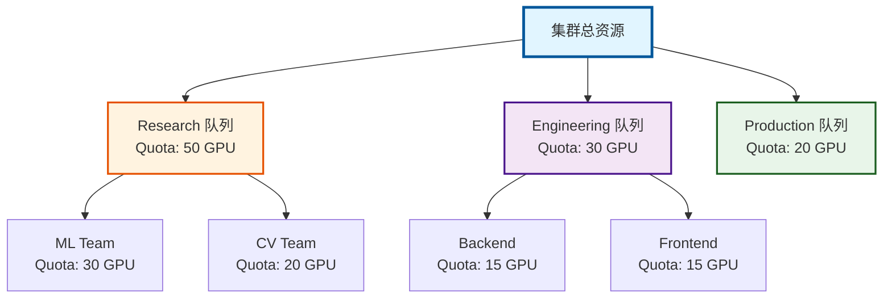

### 3.2 资源分配算法

#### 3.2.1 配额内分配（Deserved Quota）

```python
# 伪代码
remainingResources = totalResources
for queue in queues:
    deserved = min(queue.quota, queue.requested)
    queue.fairShare += deserved
    remainingResources -= deserved
```

#### 3.2.2 超配额分配（Over-Quota）

```python
# 伪代码
while remainingResources > 0:
    # 按优先级分组
    for priority_level in sorted(priorities, reverse=True):
        queues_at_priority = get_queues_by_priority(priority_level)
        totalWeights = sum(q.overQuotaWeight for q in queues_at_priority)
        
        for queue in queues_at_priority:
            share = remainingResources * queue.overQuotaWeight / totalWeights
            toAssign = min(share, queue.remainingRequest)
            queue.fairShare += toAssign
            remainingResources -= toAssign
```

### 3.3 公平共享流程

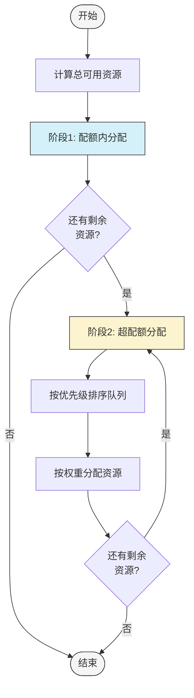

### 3.4 队列配置示例

```yaml
apiVersion: scheduling.run.ai/v2
kind: Queue
metadata:
  name: ml-training
spec:
  displayName: "ML Training Team"
  parentQueue: "research"
  priority: 100  # 超配额优先级
  resources:
    cpu:
      quota: 50000      # 50 核保证
      overQuotaWeight: 2  # 超配额权重
      limit: 100000     # 最多 100 核
    memory:
      quota: 102400     # 100GB 保证
      overQuotaWeight: 2
      limit: 204800     # 最多 200GB
    gpu:
      quota: 10         # 10 GPU 保证
      overQuotaWeight: 3  # GPU 权重更高
      limit: 20         # 最多 20 GPU
```

## 4. GPU 资源管理

### 4.1 GPU 共享

KAI Scheduler 支持多种 GPU 共享方式：

#### 4.1.1 分数共享（Fractional GPU）

```yaml
apiVersion: v1
kind: Pod
metadata:
  name: gpu-shared-pod
  annotations:
    kai.scheduler/gpu-fraction: "0.5"  # 使用 50% GPU
spec:
  containers:
  - name: training
    image: pytorch:latest
    resources:
      limits:
        nvidia.com/gpu: 1
```

**工作原理**:
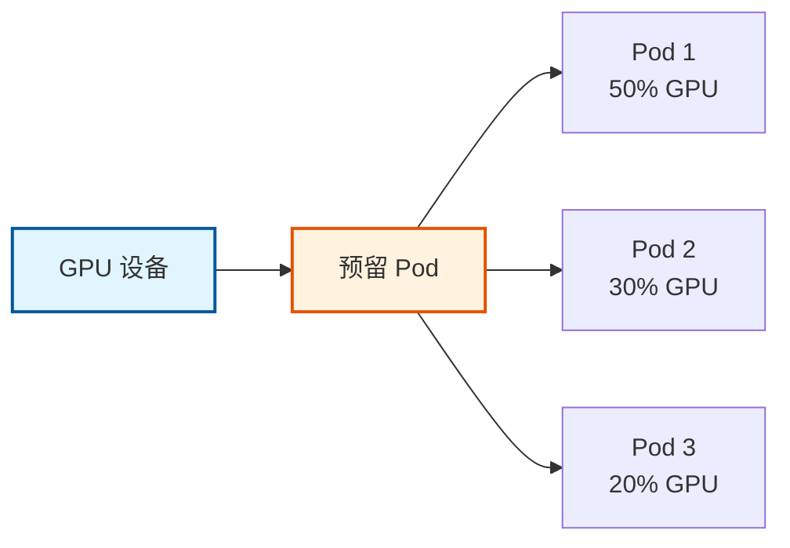

#### 4.1.2 内存共享（GPU Memory）

```yaml
apiVersion: v1
kind: Pod
metadata:
  name: gpu-memory-pod
  annotations:
    kai.scheduler/gpu-memory: "2000"  # 2000 MiB
spec:
  containers:
  - name: inference
    image: tensorflow:latest
    resources:
      limits:
        nvidia.com/gpu: 1
```

#### 4.1.3 MIG 支持

支持 NVIDIA Multi-Instance GPU (MIG)：

```yaml
resources:
  limits:
    nvidia.com/mig-1g.5gb: 1  # 1/7 A100 (5GB)
```

### 4.2 GPU 调度策略

#### 4.2.1 GPU Pack（打包）

将 GPU 工作负载集中到少数节点，提高利用率：

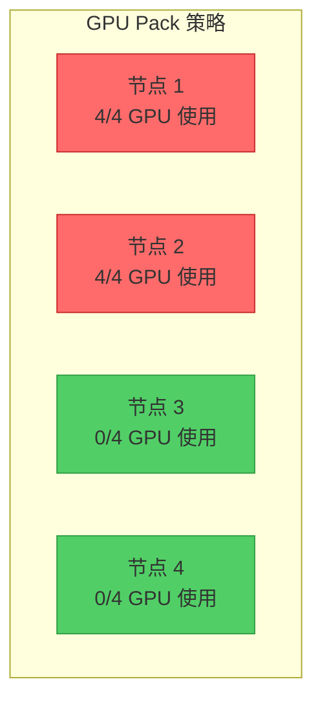

#### 4.2.2 GPU Spread（分散）

将 GPU 工作负载分散到多个节点，提高可用性：

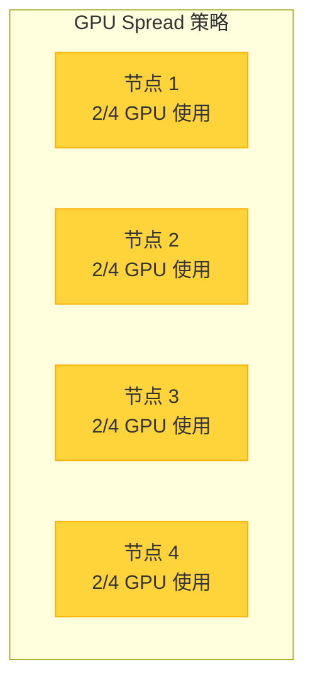

### 4.3 动态资源分配（DRA）

支持 Kubernetes 1.26+ 的 DRA 特性：

```yaml
apiVersion: v1
kind: Pod
metadata:
  name: dra-pod
spec:
  resourceClaims:
  - name: gpu-claim
    source:
      resourceClaimTemplateName: gpu-template
  containers:
  - name: workload
    image: app:latest
    resources:
      claims:
      - name: gpu-claim
```

## 5. 拓扑感知调度

### 5.1 拓扑定义

```yaml
apiVersion: kai.scheduler/v1alpha1
kind: Topology
metadata:
  name: cluster-topology
spec:
  levels:
  - nodeLabel: "topology.kubernetes.io/zone"      # 区域
  - nodeLabel: "topology.kubernetes.io/rack"      # 机架
  - nodeLabel: "kubernetes.io/hostname"           # 主机
```

### 5.2 拓扑约束

```yaml
apiVersion: batch/v1
kind: Job
metadata:
  name: distributed-training
  annotations:
    kai.scheduler/topology: "cluster-topology"
    kai.scheduler/topology-required-placement: "topology.kubernetes.io/zone"
    kai.scheduler/topology-preferred-placement: "topology.kubernetes.io/rack"
spec:
  parallelism: 8
  # ...
```

### 5.3 拓扑调度策略

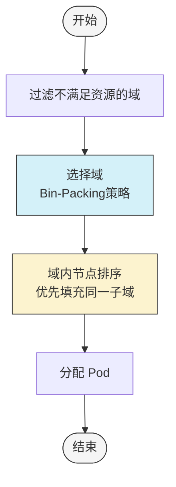

**示例场景**:

集群拓扑：
- Zone A: 5 GPU (Rack 1: 2 GPU, Rack 2-4: 各 1 GPU)
- Zone B: 6 GPU (Rack 1-3: 各 2 GPU)

工作负载：3 个 Pod，每个需要 1 GPU

**调度决策**:
1. 选择 Zone A（资源较少，Bin-Packing）
2. 优先填充 Rack 1（2 GPU）→ 2 个 Pod
3. 然后 Rack 2（1 GPU）→ 1 个 Pod
4. 结果：3 个 Pod 分布在 2 个机架（而非 3 个）

## 6. 弹性工作负载

### 6.1 弹性配置

```yaml
apiVersion: kubeflow.org/v1
kind: PyTorchJob
metadata:
  name: elastic-training
spec:
  pytorchReplicaSpecs:
    Worker:
      replicas: 5        # 期望副本数
      minReplicas: 2     # 最小副本数（Gang 阈值）
      maxReplicas: 10    # 最大副本数
      template:
        spec:
          containers:
          - name: pytorch
            image: pytorch:elastic
```

### 6.2 弹性调度流程

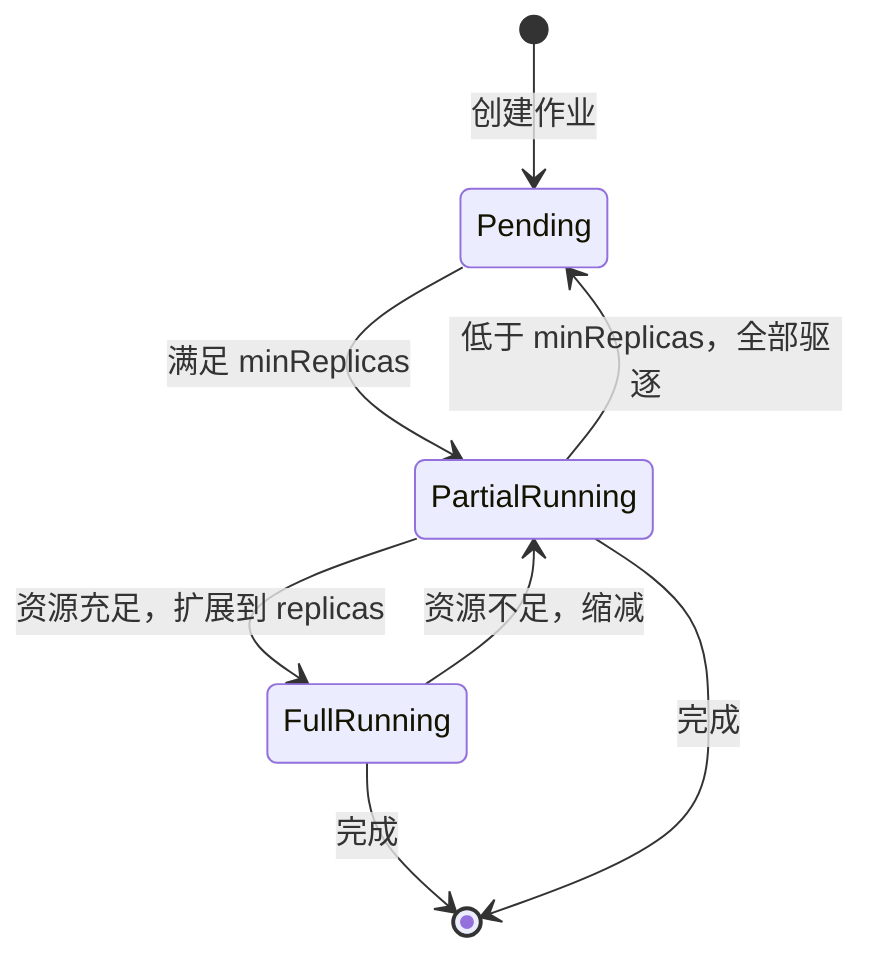

### 6.3 弹性策略

1. **优先驱逐非 Leader Pod**: 保持训练协调器运行
2. **渐进式扩展**: 逐步增加副本数
3. **快速缩减**: 资源紧张时快速释放
4. **保持 minReplicas**: 确保最小工作集

## 7. 优先级与抢占

### 7.1 优先级类

```yaml
apiVersion: scheduling.k8s.io/v1
kind: PriorityClass
metadata:
  name: high-priority-training
value: 1000000
globalDefault: false
description: "High priority for critical training jobs"
```

### 7.2 抢占流程

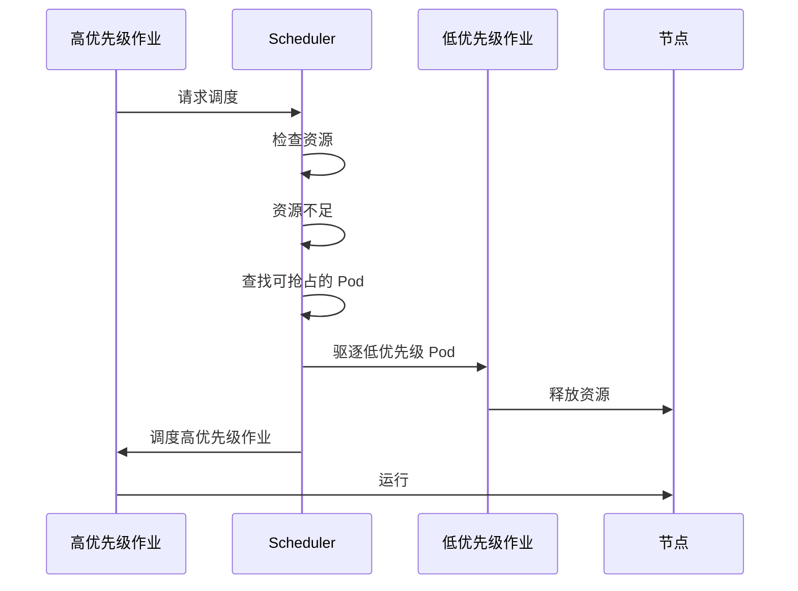

### 7.3 抢占策略

1. **队列内抢占**: 同一队列内，高优先级抢占低优先级
2. **保护期**: 最小运行时间保护，避免频繁抢占
3. **Gang 感知**: 抢占时考虑 Gang 约束
4. **成本最小化**: 选择影响最小的抢占方案

## 8. 资源回收（Reclaim）

### 8.1 回收策略

#### 8.1.1 Fair Share Reclaim

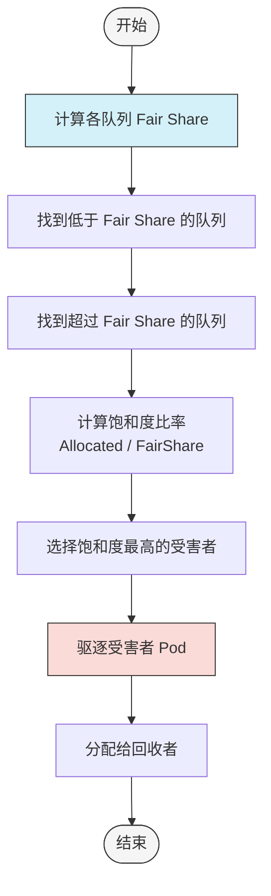

#### 8.1.2 Quota Reclaim

从超配额队列回收资源给配额不足的队列。

### 8.2 回收敏感度

```yaml
pluginArguments:
  proportion:
    reclaimerUtilizationMultiplier: "1.2"  # 更保守的回收
```

- `1.0`: 标准比较（默认）
- `> 1.0`: 更保守，减少回收频率
- `< 1.0`: 不允许（防止无限循环）

## 9. 资源整合（Consolidation）

### 9.1 整合目标

将运行中的工作负载重新分配，减少碎片，提高利用率：

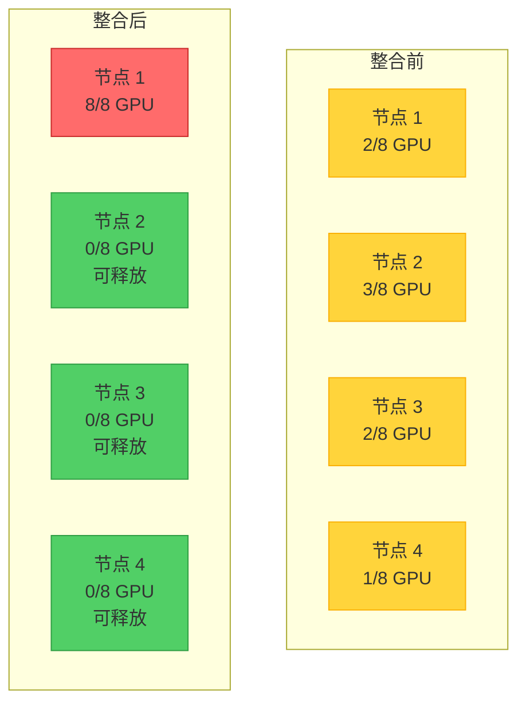

### 9.2 整合策略

1. **非破坏性**: 只有在所有被驱逐的 Pod 都能重新调度时才执行
2. **成本感知**: 优先整合小型工作负载
3. **Gang 保护**: 不破坏 Gang 约束
4. **优先级保护**: 不整合高优先级作业

## 10. 基于时间的公平共享

### 10.1 时间衰减公式

$$U = 0.5^{\frac{\Delta{t}}{t_{1/2}}} \times A$$

其中：
- $U$: 使用量
- $t_{1/2}$: 半衰期
- $\Delta{t}$: 经过的时间
- $A$: 分配的资源

### 10.2 配置示例

```yaml
apiVersion: kai.scheduler/v1
kind: SchedulingShard
metadata:
  name: default
spec:
  usageDBConfig:
    clientType: prometheus
    usageParams:
      windowSize: 1w          # 考虑 1 周的历史
      windowType: sliding     # 滑动窗口
      halfLifePeriod: 10m     # 10 分钟半衰期
  kValue: 0.5                 # 历史使用的影响权重
```

### 10.3 效果

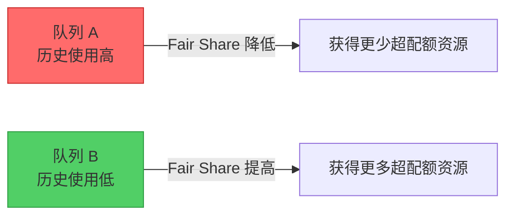

## 11. 工作负载类型支持

### 11.1 支持的框架

| 框架 | 支持程度 | Gang Scheduling | 弹性支持 |
|------|---------|----------------|---------|
| **Kubeflow Training** | ✅ 完整 | ✅ | ✅ |
| - PyTorchJob | ✅ | ✅ | ✅ |
| - TensorFlowJob | ✅ | ✅ | ⚠️ |
| - MPIJob | ✅ | ✅ | ❌ |
| - XGBoostJob | ✅ | ✅ | ❌ |
| **Ray** | ✅ 完整 | ✅ | ✅ |
| **JobSet** | ✅ 完整 | ✅ | ❌ |
| **LeaderWorkerSet** | ✅ 完整 | ✅ | ✅ |
| **Knative** | ✅ 完整 | ❌ | ✅ |
| **Argo Workflows** | ✅ 完整 | ✅ | ❌ |
| **Spark** | ⚠️ 基础 | ✅ | ❌ |
| **Batch Job** | ✅ 完整 | 可选 | ❌ |
| **Deployment** | ✅ 完整 | ❌ | ✅ |

### 11.2 工作负载场景

#### 11.2.1 分布式训练
- Gang Scheduling 确保所有节点同时启动
- 拓扑感知优化通信性能
- 弹性支持动态调整规模

#### 11.2.2 推理服务
- 不需要 Gang Scheduling
- 支持自动扩缩容
- GPU 共享提高利用率

#### 11.2.3 交互式作业
- 高优先级快速调度
- 资源预留保证响应时间
- 支持 Jupyter Notebook

#### 11.2.4 批处理作业
- 低优先级，可被抢占
- 利用空闲资源
- 支持大规模并行

## 12. 调度能力总结

### 12.1 核心优势

1. **Gang Scheduling**: 支持层级 SubGroups，适应复杂工作负载
2. **GPU 优化**: 共享、打包、拓扑感知，最大化 GPU 利用率
3. **公平性**: DRF + 时间衰减，确保长期公平
4. **弹性**: 动态扩缩容，适应资源变化
5. **拓扑感知**: 多级拓扑，优化网络性能
6. **资源整合**: 主动碎片整理，提高利用率
7. **多租户**: 层级队列，隔离和共享并存

### 12.2 适用场景

✅ **最适合**:
- 大规模 AI/ML 训练集群
- 多租户 GPU 共享环境
- 需要高资源利用率的场景
- 拓扑敏感的分布式应用

⚠️ **需要考虑**:
- 小规模集群（可能过于复杂）
- 纯 CPU 工作负载（优势不明显）
- 简单的批处理作业（默认调度器可能足够）

### 12.3 性能指标

- **调度延迟**: < 1 秒（大多数情况）
- **集群规模**: 支持数千节点
- **作业吞吐**: 每秒数百个调度决策
- **GPU 利用率**: 可提升 30-50%（通过共享和整合）
- **资源公平性**: DRF 保证，时间衰减优化

## 13. 与业务场景的映射

### 13.1 AI 训练平台
- **需求**: 大规模分布式训练，GPU 资源管理
- **能力**: Gang Scheduling + GPU 共享 + 拓扑感知
- **收益**: 训练效率提升，资源利用率提高

### 13.2 推理服务平台
- **需求**: 高并发推理，资源弹性
- **能力**: GPU 共享 + 弹性工作负载 + 优先级
- **收益**: 降低成本，提高响应速度

### 13.3 多租户研究平台
- **需求**: 公平性，资源隔离
- **能力**: 层级队列 + 时间衰减公平性 + 配额管理
- **收益**: 用户满意度提升，资源分配公平

### 13.4 混合工作负载集群
- **需求**: 训练、推理、交互式作业共存
- **能力**: 优先级抢占 + 资源回收 + 弹性调度
- **收益**: 资源利用率最大化，各类作业和谐共存

