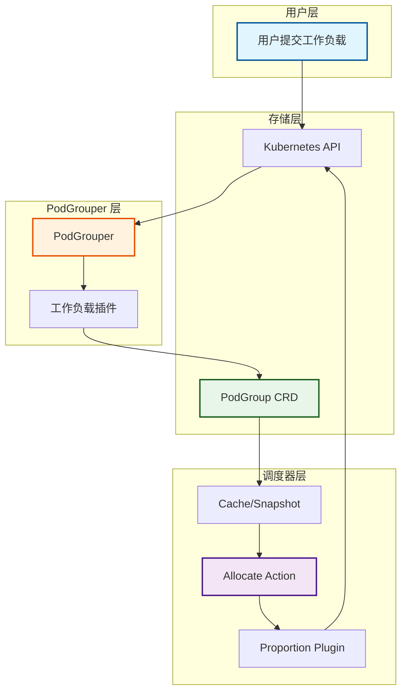
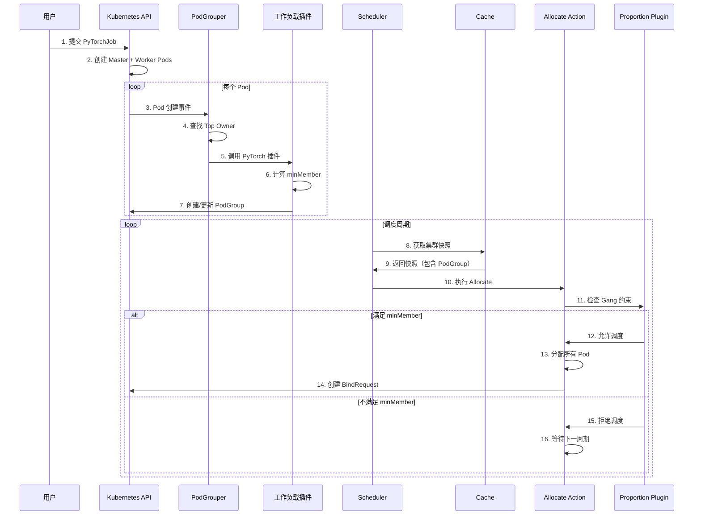
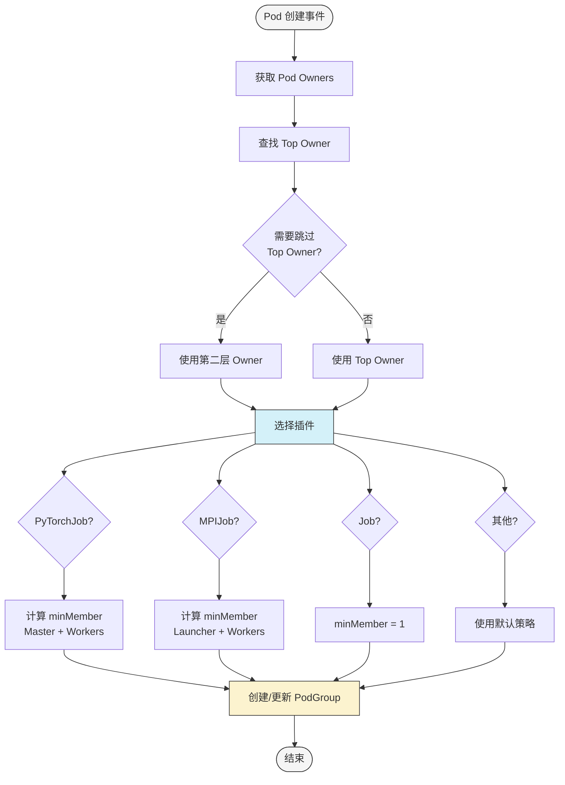

# Gang Scheduling 实现流程详解

## 1. Gang Scheduling 概述

Gang Scheduling（批量调度）是 KAI Scheduler 的核心特性之一，确保一组相关的 Pod 要么全部调度成功，要么全部不调度。这对于分布式训练等场景至关重要。

## 2. 整体架构



## 3. 完整流程



## 4. 阶段一：PodGroup 创建

### 4.1 PodGrouper 工作流程



### 4.2 PyTorchJob 插件实现

```go
// pkg/podgrouper/podgrouper/plugins/kubeflow/pytorch/pytorch_grouper.go

func (pg *PyTorchJobPodGrouper) GetPodGroupMetadata(
    topOwner *unstructured.Unstructured,
    pod *v1.Pod,
    otherOwners ...*metav1.PartialObjectMetadata,
) (*podgroup.Metadata, error) {
    // 1. 获取默认元数据
    podGroupMetadata, err := pg.DefaultGrouper.GetPodGroupMetadata(topOwner, pod)
    if err != nil {
        return nil, err
    }

    // 2. 提取 PyTorchJob 规范
    spec, found, err := unstructured.NestedMap(topOwner.Object, "spec")
    if err != nil || !found {
        return nil, fmt.Errorf("spec not found")
    }

    // 3. 计算 minMember
    minMember := int32(0)
    replicaSpecs, found := spec["pytorchReplicaSpecs"].(map[string]interface{})
    if found {
        for replicaType, replicaSpec := range replicaSpecs {
            replicas := getReplicaCount(replicaSpec)
            minReplicas := getMinReplicaCount(replicaSpec)
            
            // 使用 minReplicas（弹性）或 replicas
            if minReplicas > 0 {
                minMember += minReplicas
            } else {
                minMember += replicas
            }
        }
    }

    // 4. 设置 minMember
    podGroupMetadata.MinAvailable = minMember
    
    // 5. 设置优先级类（默认为 Train）
    if podGroupMetadata.PriorityClassName == "" {
        podGroupMetadata.PriorityClassName = "Train"
    }

    return podGroupMetadata, nil
}
```

### 4.3 PodGroup CRD 结构

```yaml
apiVersion: scheduling.run.ai/v2alpha2
kind: PodGroup
metadata:
  name: pytorch-job-12345
  namespace: default
  ownerReferences:
  - apiVersion: kubeflow.org/v1
    kind: PyTorchJob
    name: distributed-training
    uid: 12345-67890
spec:
  minMember: 4              # 1 Master + 3 Workers
  queue: ml-training        # 队列名称
  priorityClassName: Train  # 优先级类
status:
  phase: Pending
  allocated: 0
  running: 0
  succeeded: 0
  failed: 0
```

## 5. 阶段二：调度器处理

### 5.1 Cache 快照获取

```go
// pkg/scheduler/cache/cache.go

func (sc *SchedulerCache) Snapshot() *api.ClusterInfo {
    sc.Mutex.Lock()
    defer sc.Mutex.Unlock()

    snapshot := &api.ClusterInfo{
        Nodes:          make(map[string]*node_info.NodeInfo),
        PodGroupInfos:  make(map[string]*podgroup_info.PodGroupInfo),
        Queues:         make(map[string]*queue_info.QueueInfo),
        // ...
    }

    // 复制 PodGroup 信息
    for uid, pg := range sc.PodGroups {
        snapshot.PodGroupInfos[uid] = pg.Clone()
    }

    // 复制节点信息
    for name, node := range sc.Nodes {
        snapshot.Nodes[name] = node.Clone()
    }

    return snapshot
}
```

### 5.2 Allocate Action 执行

```go
// pkg/scheduler/actions/allocate/allocate.go

func (alloc *allocateAction) Execute(ssn *framework.Session) {
    // 1. 初始化作业队列（按优先级排序）
    jobsOrderByQueues := utils.NewJobsOrderByQueues(ssn, utils.JobsOrderInitOptions{
        FilterNonPending:  true,
        FilterUnready:     true,
        MaxJobsQueueDepth: ssn.GetJobsDepth(framework.Allocate),
    })
    jobsOrderByQueues.InitializeWithJobs(ssn.ClusterInfo.PodGroupInfos)

    // 2. 遍历所有作业
    for !jobsOrderByQueues.IsEmpty() {
        job := jobsOrderByQueues.PopNextJob()
        
        // 3. 创建 Statement（事务）
        stmt := ssn.Statement()
        
        // 4. 尝试分配作业
        if ok, pipelined := attemptToAllocateJob(ssn, stmt, job); ok {
            // 5. 提交 Statement
            err := stmt.Commit()
            if err == nil && podgroup_info.HasTasksToAllocate(job, true) {
                // 6. 如果还有任务未分配，重新加入队列
                jobsOrderByQueues.PushJob(job)
            }
        } else {
            // 7. 分配失败，丢弃 Statement
            stmt.Discard()
        }
    }
}
```

