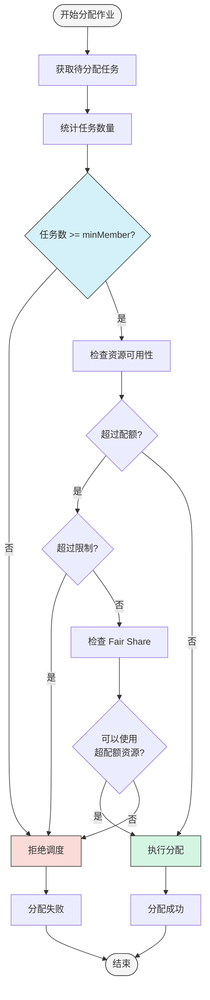
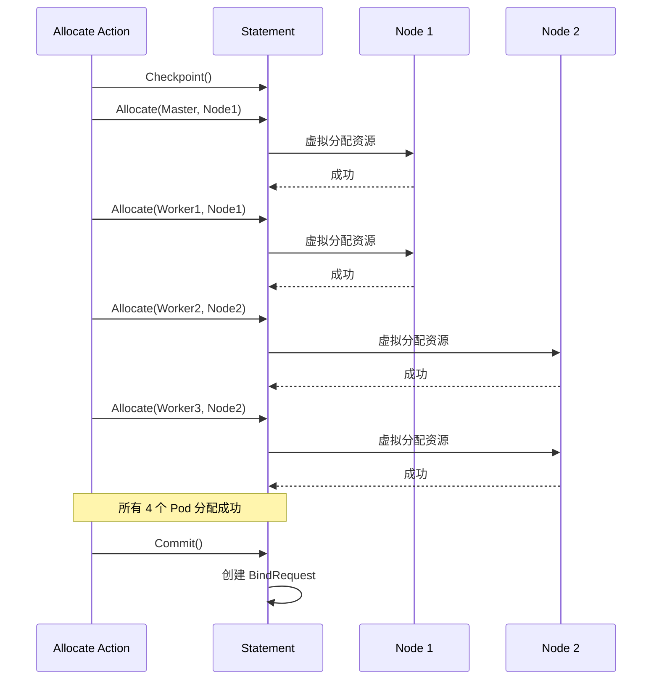
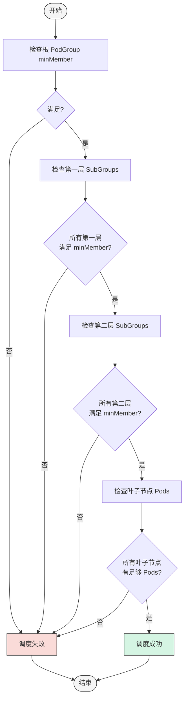
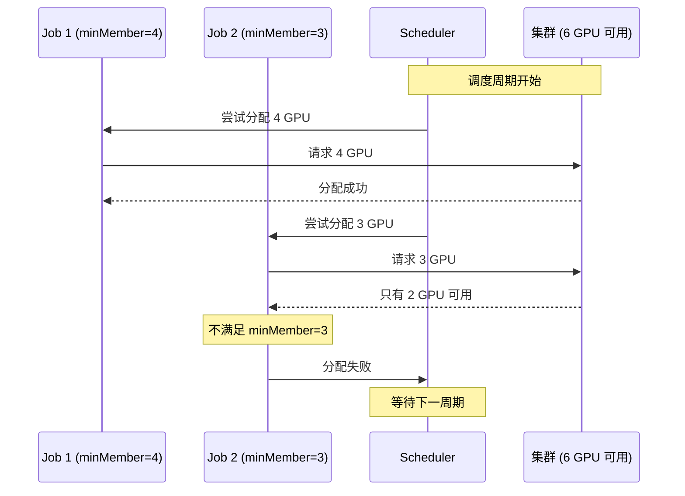
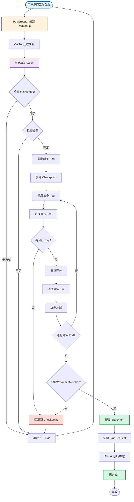

# Gang Scheduling 实现流程详解（续）

## 6. 阶段三：Gang 约束检查

### 6.1 Proportion Plugin 的 Gang 检查

```go
// pkg/scheduler/plugins/proportion/proportion.go

func (pp *proportionPlugin) OnSessionOpen(ssn *framework.Session) {
    // ... 其他初始化 ...
    
    // 注册容量检查函数
    ssn.AddIsJobOverCapacityFn(capacityPolicy.IsJobOverQueueCapacity)
    
    // 注册事件处理器
    ssn.AddEventHandler(&framework.EventHandler{
        AllocateFunc:   pp.allocateHandlerFn(ssn),
        DeallocateFunc: pp.deallocateHandlerFn(ssn),
    })
}

// 检查作业是否超过队列容量
func (cp *CapacityPolicy) IsJobOverQueueCapacity(
    job *podgroup_info.PodGroupInfo,
    tasks []*pod_info.PodInfo,
) *api.CapacityCheckResult {
    queue := cp.queues[job.Queue]
    
    // 1. 计算作业需要的资源
    jobResources := calculateJobResources(tasks)
    
    // 2. 检查是否超过队列限制
    if exceedsLimit(queue, jobResources) {
        return &api.CapacityCheckResult{
            IsSchedulable: false,
            Reason: "Exceeds queue limit",
        }
    }
    
    // 3. 检查是否满足 minMember
    if len(tasks) < int(job.MinMember) {
        return &api.CapacityCheckResult{
            IsSchedulable: false,
            Reason: "Does not meet minMember requirement",
        }
    }
    
    return &api.CapacityCheckResult{
        IsSchedulable: true,
    }
}
```

### 6.2 Gang 约束验证流程



## 7. 阶段四：资源分配

### 7.1 AllocateJob 函数

```go
// pkg/scheduler/actions/common/allocate.go

func AllocateJob(
    ssn *framework.Session,
    stmt *framework.Statement,
    nodes []*node_info.NodeInfo,
    job *podgroup_info.PodGroupInfo,
    allowPipelining bool,
) bool {
    // 1. 获取待分配的任务
    tasks := podgroup_info.GetTasksToAllocate(job, ssn.PodSetOrderFn, ssn.TaskOrderFn, false)
    
    // 2. 检查是否满足 minMember
    if len(tasks) < int(job.MinMember) {
        log.V(3).Infof("Job %s/%s does not have enough tasks (%d < %d)",
            job.Namespace, job.Name, len(tasks), job.MinMember)
        return false
    }
    
    // 3. 创建 Checkpoint（用于回滚）
    checkpoint := stmt.Checkpoint()
    
    // 4. 尝试为每个任务分配节点
    allocatedCount := 0
    for _, task := range tasks {
        // 4.1 查找可行节点
        feasibleNodes := findFeasibleNodes(ssn, task, job, nodes)
        if len(feasibleNodes) == 0 {
            // 没有可行节点，回滚
            stmt.Rollback(checkpoint)
            return false
        }
        
        // 4.2 对节点评分
        nodeScores := scoreNodes(ssn, task, feasibleNodes)
        
        // 4.3 选择最佳节点
        bestNode := selectBestNode(nodeScores)
        
        // 4.4 分配任务到节点
        err := stmt.Allocate(task, bestNode)
        if err != nil {
            // 分配失败，回滚
            stmt.Rollback(checkpoint)
            return false
        }
        
        allocatedCount++
    }
    
    // 5. 检查是否分配了足够的任务
    if allocatedCount < int(job.MinMember) {
        stmt.Rollback(checkpoint)
        return false
    }
    
    // 6. 所有任务分配成功
    return true
}
```

### 7.2 Statement 的 Allocate 操作

```go
// pkg/scheduler/framework/statement.go

func (s *Statement) Allocate(task *pod_info.PodInfo, node *node_info.NodeInfo) error {
    // 1. 检查节点资源是否充足
    if !node.HasSufficientResources(task) {
        return fmt.Errorf("node %s has insufficient resources", node.Name)
    }
    
    // 2. 执行谓词检查
    for _, predicateFn := range s.ssn.PredicateFns {
        if err := predicateFn(task, job, node); err != nil {
            return err
        }
    }
    
    // 3. 虚拟分配资源
    node.AllocateResources(task)
    task.NodeName = node.Name
    task.Status = pod_status.Allocated
    
    // 4. 记录操作（用于回滚）
    s.operations = append(s.operations, &Operation{
        Type: AllocateOp,
        Task: task,
        Node: node,
    })
    
    // 5. 触发 Allocate 事件
    event := &Event{
        Task: task,
        Node: node,
    }
    for _, handler := range s.ssn.eventHandlers {
        if handler.AllocateFunc != nil {
            handler.AllocateFunc(event)
        }
    }
    
    return nil
}
```

### 7.3 资源分配示例

假设有一个 PyTorchJob，包含 1 个 Master 和 3 个 Worker：



## 8. 阶段五：绑定执行

### 8.1 BindRequest 创建

```go
// pkg/scheduler/framework/statement.go

func (s *Statement) Commit() error {
    // 1. 遍历所有分配操作
    for _, op := range s.operations {
        if op.Type == AllocateOp {
            // 2. 创建 BindRequest
            bindRequest := &v1alpha2.BindRequest{
                ObjectMeta: metav1.ObjectMeta{
                    Name:      fmt.Sprintf("%s-%s", op.Task.Name, op.Node.Name),
                    Namespace: op.Task.Namespace,
                },
                Spec: v1alpha2.BindRequestSpec{
                    PodName:      op.Task.Name,
                    SelectedNode: op.Node.Name,
                    // GPU 分配信息
                    SelectedGPUGroups: op.Task.SelectedGPUGroups,
                    // DRA 信息
                    ResourceClaims: op.Task.ResourceClaims,
                },
            }
            
            // 3. 提交到 Kubernetes API
            err := s.ssn.Cache.CreateBindRequest(bindRequest)
            if err != nil {
                return err
            }
        }
    }
    
    return nil
}
```

### 8.2 Binder 处理

```go
// pkg/binder/controllers/bindrequest_controller.go

func (r *BindRequestReconciler) Reconcile(ctx context.Context, req ctrl.Request) (ctrl.Result, error) {
    // 1. 获取 BindRequest
    bindRequest := &v1alpha2.BindRequest{}
    err := r.Get(ctx, req.NamespacedName, bindRequest)
    if err != nil {
        return ctrl.Result{}, err
    }
    
    // 2. 获取 Pod 和 Node
    pod := &v1.Pod{}
    err = r.Get(ctx, types.NamespacedName{
        Namespace: bindRequest.Namespace,
        Name:      bindRequest.Spec.PodName,
    }, pod)
    if err != nil {
        return ctrl.Result{}, err
    }
    
    node := &v1.Node{}
    err = r.Get(ctx, types.NamespacedName{
        Name: bindRequest.Spec.SelectedNode,
    }, node)
    if err != nil {
        return ctrl.Result{}, err
    }
    
    // 3. 执行绑定
    err = r.Binder.Bind(ctx, pod, node, bindRequest)
    if err != nil {
        // 4. 绑定失败，回滚
        r.Binder.Rollback(ctx, pod, node, bindRequest)
        
        // 5. 更新 BindRequest 状态
        bindRequest.Status.Phase = v1alpha2.BindRequestFailed
        bindRequest.Status.Reason = err.Error()
        r.Status().Update(ctx, bindRequest)
        
        return ctrl.Result{Requeue: true}, err
    }
    
    // 6. 绑定成功，更新状态
    bindRequest.Status.Phase = v1alpha2.BindRequestSucceeded
    r.Status().Update(ctx, bindRequest)
    
    return ctrl.Result{}, nil
}
```

## 9. 层级 Gang Scheduling（SubGroups）

### 9.1 SubGroups 结构

```yaml
apiVersion: scheduling.run.ai/v2alpha2
kind: PodGroup
metadata:
  name: hierarchical-job
spec:
  minMember: 2  # 至少需要 2 个顶层 SubGroup
  subGroups:
    # 顶层 SubGroup: decode
    - name: decode
      minMember: 2  # decode 需要 2 个子 SubGroup
    
    # decode 的子 SubGroup
    - name: decode-workers
      parent: decode
      minMember: 4
    
    - name: decode-leaders
      parent: decode
      minMember: 1
    
    # 顶层 SubGroup: prefill
    - name: prefill
      minMember: 2
    
    # prefill 的子 SubGroup
    - name: prefill-workers
      parent: prefill
      minMember: 4
    
    - name: prefill-leaders
      parent: prefill
      minMember: 1
```

### 9.2 层级验证逻辑

```go
// pkg/scheduler/utils/pod_group_utils.go

func ValidateSubGroupsHierarchy(job *podgroup_info.PodGroupInfo) error {
    // 1. 构建 SubGroup 树
    tree := buildSubGroupTree(job.SubGroups)
    
    // 2. 验证每个 SubGroup 的 minMember
    for _, subGroup := range tree.Nodes {
        // 2.1 统计子节点
        childCount := 0
        for _, child := range subGroup.Children {
            if child.HasEnoughMembers() {
                childCount++
            }
        }
        
        // 2.2 检查是否满足 minMember
        if childCount < subGroup.MinMember {
            return fmt.Errorf("SubGroup %s does not have enough children (%d < %d)",
                subGroup.Name, childCount, subGroup.MinMember)
        }
    }
    
    return nil
}
```

### 9.3 层级 Gang 调度流程



## 10. Gang Scheduling 的边界情况

### 10.1 部分失败处理

```go
// 场景：4 个 Pod 中有 3 个分配成功，1 个失败

func attemptToAllocateJob(ssn *framework.Session, stmt *framework.Statement, job *podgroup_info.PodGroupInfo) bool {
    checkpoint := stmt.Checkpoint()
    
    allocatedCount := 0
    for _, task := range tasks {
        if err := allocateTask(ssn, stmt, task); err != nil {
            // 分配失败，回滚所有已分配的任务
            stmt.Rollback(checkpoint)
            return false
        }
        allocatedCount++
    }
    
    // 检查是否满足 minMember
    if allocatedCount < int(job.MinMember) {
        stmt.Rollback(checkpoint)
        return false
    }
    
    return true
}
```

### 10.2 资源竞争处理



### 10.3 Stale Gang Eviction

```go
// pkg/scheduler/actions/stalegangeviction/stalegangeviction.go

func (sge *staleGangEvictionAction) Execute(ssn *framework.Session) {
    for _, job := range ssn.ClusterInfo.PodGroupInfos {
        // 1. 检查是否是 Gang 作业
        if job.MinMember <= 1 {
            continue
        }
        
        // 2. 统计运行中的 Pod
        runningCount := job.GetRunningTasksCount()
        
        // 3. 检查是否低于 minMember
        if runningCount > 0 && runningCount < int(job.MinMember) {
            // 4. 检查是否超过宽限期
            if time.Since(job.LastTransitionTime) > gracePeriod {
                // 5. 驱逐所有运行中的 Pod
                log.Infof("Evicting stale gang job %s/%s (running: %d, minMember: %d)",
                    job.Namespace, job.Name, runningCount, job.MinMember)
                
                for _, task := range job.Tasks {
                    if task.Status == pod_status.Running {
                        stmt.Evict(task, "Stale gang eviction")
                    }
                }
            }
        }
    }
}
```

## 11. Gang Scheduling 流程图总结



## 12. 关键要点总结

1. **原子性保证**: 通过 Statement 的 Checkpoint/Rollback 机制确保 Gang 的原子性
2. **层级支持**: 支持多层 SubGroups，实现细粒度的 Gang 调度
3. **资源保护**: 在分配前检查所有约束，避免部分分配
4. **失败处理**: 分配失败时自动回滚，不影响集群状态
5. **过期清理**: StaleGangEviction 清理不满足 minMember 的作业，避免死锁
6. **性能优化**: 使用快照和虚拟分配，避免频繁的 API 调用

