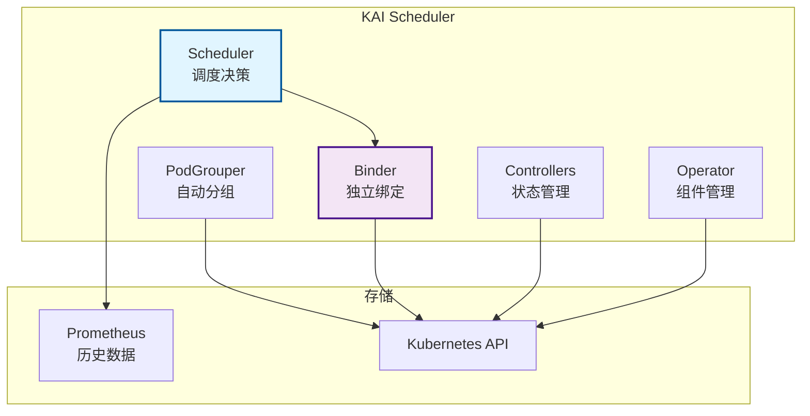
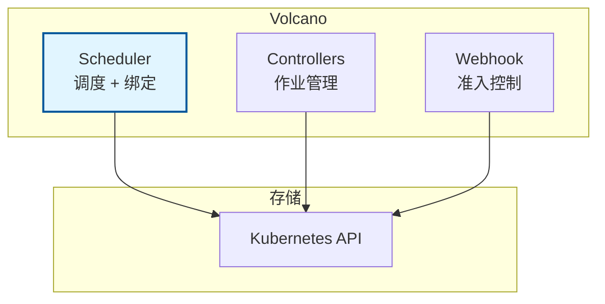
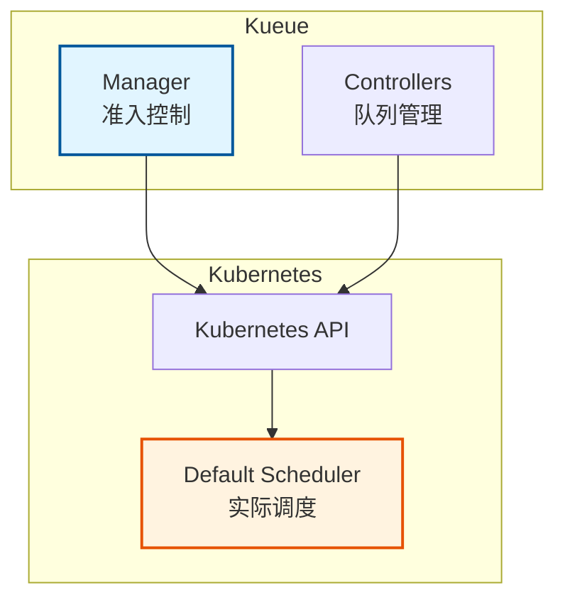

# KAI Scheduler 与主流调度器对比分析

## 1. 对比概览

本文档详细对比 KAI Scheduler 与其他主流 Kubernetes 调度器的特性、架构和适用场景。

### 1.1 对比调度器列表

- **KAI Scheduler**: NVIDIA 开发的 AI/ML 工作负载调度器
- **Volcano**: CNCF 孵化项目，批处理和 HPC 调度器
- **Kueue**: Kubernetes 官方作业排队系统
- **YuniKorn**: Apache 项目，资源调度器
- **默认 Kubernetes Scheduler**: Kubernetes 内置调度器

## 2. 详细特性对比

### 2.1 核心调度特性

| 特性 | KAI Scheduler | Volcano | Kueue | YuniKorn | K8s Default |
|------|---------------|---------|-------|----------|-------------|
| **Gang Scheduling** | ✅ 层级 SubGroups | ✅ 基础 | ✅ 通过 PodGroup | ✅ | ❌ |
| **队列管理** | ✅ 2 级层次 | ✅ 多级层次 | ✅ 层级队列 | ✅ 多级层次 | ❌ |
| **资源配额** | ✅ Quota + Limit | ✅ | ✅ | ✅ | ⚠️ ResourceQuota |
| **公平性算法** | ✅ DRF + 时间衰减 | ✅ DRF | ✅ | ✅ DRF | ❌ |
| **优先级调度** | ✅ | ✅ | ✅ | ✅ | ✅ |
| **抢占** | ✅ 队列内 + 跨队列 | ✅ | ✅ | ✅ | ✅ 基础 |
| **资源预留** | ✅ | ✅ | ❌ | ✅ | ❌ |

### 2.2 GPU 相关特性

| 特性 | KAI Scheduler | Volcano | Kueue | YuniKorn | K8s Default |
|------|---------------|---------|-------|----------|-------------|
| **GPU 共享** | ✅ 分数 + 内存 | ✅ 基础 | ⚠️ 有限 | ⚠️ 有限 | ❌ |
| **GPU 拓扑感知** | ✅ 多级拓扑 | ✅ 基础 | ❌ | ⚠️ 有限 | ⚠️ 拓扑提示 |
| **MIG 支持** | ✅ | ✅ | ❌ | ⚠️ | ✅ |
| **DRA 支持** | ✅ 完整 | ⚠️ 有限 | ❌ | ❌ | ✅ |
| **GPU Pack/Spread** | ✅ | ✅ | ❌ | ⚠️ | ❌ |
| **GPU 预留** | ✅ 独立服务 | ❌ | ❌ | ❌ | ❌ |

### 2.3 高级调度特性

| 特性 | KAI Scheduler | Volcano | Kueue | YuniKorn | K8s Default |
|------|---------------|---------|-------|----------|-------------|
| **拓扑感知** | ✅ 多级 + 细粒度 | ✅ 基础 | ❌ | ⚠️ 有限 | ⚠️ 拓扑提示 |
| **弹性工作负载** | ✅ 原生支持 | ⚠️ 有限 | ❌ | ⚠️ 有限 | ❌ |
| **资源整合** | ✅ 主动整合 | ❌ | ❌ | ❌ | ❌ |
| **时间衰减公平性** | ✅ | ❌ | ❌ | ❌ | ❌ |
| **最小运行时间** | ✅ | ❌ | ❌ | ❌ | ❌ |
| **Bin Packing** | ✅ | ✅ | ❌ | ✅ | ⚠️ 基础 |

### 2.4 架构特性

| 特性 | KAI Scheduler | Volcano | Kueue | YuniKorn | K8s Default |
|------|---------------|---------|-------|----------|-------------|
| **独立 Binder** | ✅ | ❌ | N/A | ❌ | ❌ |
| **插件架构** | ✅ 丰富 | ✅ | ⚠️ 有限 | ✅ | ✅ |
| **多调度器共存** | ✅ | ✅ | ✅ | ✅ | ✅ |
| **高可用** | ✅ | ✅ | ✅ | ✅ | ✅ |
| **水平扩展** | ✅ Sharding | ⚠️ 有限 | ✅ | ⚠️ 有限 | ❌ |

## 3. 架构对比

### 3.1 KAI Scheduler 架构

**特点**:
- 组件分离，职责清晰
- 独立 Binder 提高可靠性
- Prometheus 集成支持时间衰减公平性
- Operator 简化部署和管理

### 3.2 Volcano 架构

**特点**:
- 调度和绑定集成在一起
- 专注于批处理和 HPC
- 成熟的社区和生态

### 3.3 Kueue 架构

**特点**:
- 不是完整的调度器，是排队系统
- 依赖默认调度器进行实际调度
- 轻量级，易于集成

## 4. 性能对比

### 4.1 调度延迟

| 调度器 | 平均延迟 | P99 延迟 | 说明 |
|--------|---------|---------|------|
| **KAI Scheduler** | < 1s | < 3s | 大多数场景 |
| **Volcano** | < 1s | < 3s | 类似性能 |
| **Kueue** | < 100ms | < 500ms | 仅排队，不包括实际调度 |
| **YuniKorn** | < 1s | < 3s | 类似性能 |
| **K8s Default** | < 100ms | < 500ms | 简单场景 |

### 4.2 集群规模支持

| 调度器 | 节点数 | Pod 数 | 说明 |
|--------|--------|--------|------|
| **KAI Scheduler** | 数千 | 数万 | 针对大规模优化 |
| **Volcano** | 数千 | 数万 | 大规模支持 |
| **Kueue** | 数千 | 数万 | 依赖默认调度器 |
| **YuniKorn** | 数千 | 数万 | 大规模支持 |
| **K8s Default** | 5000 | 150000 | 官方测试规模 |

### 4.3 资源利用率提升

| 场景 | KAI Scheduler | Volcano | Kueue | 说明 |
|------|---------------|---------|-------|------|
| **GPU 共享** | +30-50% | +20-30% | N/A | GPU 利用率提升 |
| **资源整合** | +10-20% | N/A | N/A | 通过碎片整理 |
| **时间公平性** | +5-15% | N/A | N/A | 减少资源浪费 |

## 5. 工作负载支持对比

### 5.1 AI/ML 框架支持

| 框架 | KAI Scheduler | Volcano | Kueue | YuniKorn |
|------|---------------|---------|-------|----------|
| **Kubeflow Training** | ✅ 完整 | ✅ 完整 | ✅ | ✅ |
| **Ray** | ✅ 原生集成 | ✅ | ✅ | ⚠️ |
| **Spark** | ⚠️ 基础 | ✅ 完整 | ✅ | ✅ 完整 |
| **Horovod** | ✅ | ✅ | ✅ | ✅ |
| **DeepSpeed** | ✅ | ✅ | ✅ | ✅ |
| **JobSet** | ✅ | ✅ | ✅ | ⚠️ |
| **LeaderWorkerSet** | ✅ | ⚠️ | ✅ | ⚠️ |

### 5.2 工作负载类型

| 类型 | KAI Scheduler | Volcano | Kueue | 说明 |
|------|---------------|---------|-------|------|
| **分布式训练** | ✅ 优秀 | ✅ 优秀 | ✅ 良好 | Gang + 拓扑 |
| **推理服务** | ✅ 优秀 | ⚠️ 一般 | ⚠️ 一般 | GPU 共享 + 弹性 |
| **批处理作业** | ✅ 良好 | ✅ 优秀 | ✅ 优秀 | Volcano 专长 |
| **交互式作业** | ✅ 优秀 | ⚠️ 一般 | ⚠️ 一般 | 优先级 + 抢占 |
| **HPC** | ⚠️ 一般 | ✅ 优秀 | ⚠️ 一般 | Volcano 专长 |

## 6. 使用场景对比

### 6.1 KAI Scheduler 最佳场景

✅ **强烈推荐**:
- 大规模 GPU 集群（数百到数千 GPU）
- AI/ML 训练和推理混合工作负载
- 需要 GPU 共享和细粒度资源管理
- 拓扑敏感的分布式训练
- 多租户环境，需要公平性保证
- 需要历史使用数据的公平性

⚠️ **需要考虑**:
- 纯 CPU 工作负载（优势不明显）
- 小规模集群（< 10 节点）
- 简单的批处理作业

### 6.2 Volcano 最佳场景

✅ **强烈推荐**:
- HPC 和科学计算工作负载
- 大规模批处理作业
- Spark 等大数据框架
- 需要成熟社区支持
- 多种工作负载类型混合

⚠️ **需要考虑**:
- 推理服务（弹性支持有限）
- GPU 共享需求（功能较基础）
- 需要独立 Binder（不支持）

### 6.3 Kueue 最佳场景

✅ **强烈推荐**:
- 需要作业排队和准入控制
- 与现有调度器集成
- 轻量级部署
- 多集群资源管理
- 简单的资源配额管理

⚠️ **需要考虑**:
- 需要高级调度特性（依赖默认调度器）
- GPU 共享和拓扑感知
- 资源整合和优化

## 7. 迁移难度对比

### 7.1 从默认调度器迁移

| 目标调度器 | 难度 | 工作量 | 说明 |
|-----------|------|--------|------|
| **KAI Scheduler** | 中等 | 中等 | 需要创建 Queue，配置 PodGroup |
| **Volcano** | 中等 | 中等 | 需要创建 Queue，修改作业定义 |
| **Kueue** | 低 | 低 | 主要是配置 Queue 和 ResourceFlavor |
| **YuniKorn** | 中等 | 中等 | 需要配置队列和应用 |

### 7.2 从 Volcano 迁移到 KAI

**相似点**:
- 都支持 Gang Scheduling
- 都有队列概念
- 都支持 GPU 调度

**差异点**:
- KAI 使用 PodGroup v2alpha2，Volcano 使用 v1beta1
- KAI 的队列是 CRD，Volcano 的队列是 ConfigMap
- KAI 有独立的 Binder 组件

**迁移步骤**:
1. 部署 KAI Scheduler（可与 Volcano 共存）
2. 创建对应的 Queue CRD
3. 逐步迁移工作负载
4. 验证功能正常
5. 下线 Volcano

## 8. 成本对比

### 8.1 部署成本

| 调度器 | 组件数 | 资源需求 | 复杂度 |
|--------|--------|---------|--------|
| **KAI Scheduler** | 7+ | 中等 | 中等 |
| **Volcano** | 3 | 低 | 低 |
| **Kueue** | 1 | 很低 | 很低 |
| **YuniKorn** | 2 | 低 | 低 |

### 8.2 运维成本

| 调度器 | 监控 | 故障排查 | 升级 |
|--------|------|---------|------|
| **KAI Scheduler** | Prometheus 集成 | 中等 | Helm 升级 |
| **Volcano** | 需要自行配置 | 中等 | Helm 升级 |
| **Kueue** | 基础指标 | 简单 | Helm 升级 |
| **YuniKorn** | Web UI | 中等 | Helm 升级 |

### 8.3 学习成本

| 调度器 | 文档质量 | 社区活跃度 | 学习曲线 |
|--------|---------|-----------|---------|
| **KAI Scheduler** | 优秀 | 活跃 | 中等 |
| **Volcano** | 优秀 | 非常活跃 | 中等 |
| **Kueue** | 优秀 | 活跃 | 低 |
| **YuniKorn** | 良好 | 活跃 | 中等 |

## 9. 生态系统对比

### 9.1 社区和支持

| 调度器 | 组织 | 开源时间 | 社区规模 | 商业支持 |
|--------|------|---------|---------|---------|
| **KAI Scheduler** | NVIDIA | 2025 | 成长中 | NVIDIA |
| **Volcano** | CNCF | 2019 | 大型 | 多家厂商 |
| **Kueue** | Kubernetes | 2022 | 大型 | Google |
| **YuniKorn** | Apache | 2019 | 中型 | Cloudera |

### 9.2 集成生态

| 集成 | KAI Scheduler | Volcano | Kueue | YuniKorn |
|------|---------------|---------|-------|----------|
| **Kubeflow** | ✅ | ✅ | ✅ | ✅ |
| **Ray** | ✅ 原生 | ✅ | ✅ | ⚠️ |
| **Argo Workflows** | ✅ | ✅ | ✅ | ✅ |
| **Karpenter** | ✅ | ⚠️ | ✅ | ⚠️ |
| **Prometheus** | ✅ 深度集成 | ⚠️ | ⚠️ | ⚠️ |
| **Grafana** | ✅ | ✅ | ✅ | ✅ |

## 10. 决策矩阵

### 10.1 选择 KAI Scheduler 的理由

1. **GPU 密集型工作负载**: 需要 GPU 共享、拓扑感知
2. **混合工作负载**: 训练 + 推理 + 交互式
3. **公平性要求高**: 需要时间衰减的公平性
4. **大规模集群**: 数百到数千 GPU
5. **NVIDIA 生态**: 使用 NVIDIA GPU 和工具链
6. **资源优化**: 需要主动整合和碎片整理

### 10.2 选择 Volcano 的理由

1. **HPC 工作负载**: 科学计算、仿真
2. **成熟度要求**: 需要经过验证的解决方案
3. **大数据**: Spark、Flink 等
4. **社区支持**: 需要活跃的社区
5. **多样化工作负载**: 不仅限于 AI/ML
6. **多级队列**: 需要复杂的队列层次

### 10.3 选择 Kueue 的理由

1. **轻量级**: 不想替换默认调度器
2. **简单场景**: 基础的排队和配额管理
3. **多集群**: 需要跨集群资源管理
4. **Kubernetes 原生**: 希望使用官方项目
5. **快速部署**: 需要快速上线
6. **与现有系统集成**: 最小化改动

## 11. 总结

### 11.1 综合评分（满分 5 分）

| 维度 | KAI Scheduler | Volcano | Kueue | YuniKorn |
|------|---------------|---------|-------|----------|
| **GPU 支持** | ⭐⭐⭐⭐⭐ | ⭐⭐⭐ | ⭐⭐ | ⭐⭐ |
| **Gang Scheduling** | ⭐⭐⭐⭐⭐ | ⭐⭐⭐⭐ | ⭐⭐⭐⭐ | ⭐⭐⭐⭐ |
| **公平性** | ⭐⭐⭐⭐⭐ | ⭐⭐⭐⭐ | ⭐⭐⭐ | ⭐⭐⭐⭐ |
| **拓扑感知** | ⭐⭐⭐⭐⭐ | ⭐⭐⭐ | ⭐ | ⭐⭐ |
| **易用性** | ⭐⭐⭐ | ⭐⭐⭐⭐ | ⭐⭐⭐⭐⭐ | ⭐⭐⭐ |
| **成熟度** | ⭐⭐⭐ | ⭐⭐⭐⭐⭐ | ⭐⭐⭐⭐ | ⭐⭐⭐⭐ |
| **性能** | ⭐⭐⭐⭐⭐ | ⭐⭐⭐⭐ | ⭐⭐⭐⭐ | ⭐⭐⭐⭐ |
| **社区** | ⭐⭐⭐ | ⭐⭐⭐⭐⭐ | ⭐⭐⭐⭐ | ⭐⭐⭐ |

### 11.2 最终建议

**选择 KAI Scheduler 如果**:
- 你的主要工作负载是 AI/ML
- 你有大量 GPU 资源需要管理
- 你需要 GPU 共享和拓扑感知
- 你重视资源利用率优化
- 你使用 NVIDIA GPU

**选择 Volcano 如果**:
- 你有多样化的工作负载（HPC、大数据、AI）
- 你需要成熟稳定的解决方案
- 你的社区支持很重要
- 你需要复杂的队列层次

**选择 Kueue 如果**:
- 你需要轻量级的排队系统
- 你不想替换默认调度器
- 你的需求相对简单
- 你希望使用 Kubernetes 官方项目

**可以共存**:
- KAI Scheduler 和 Kueue 可以共存
- 不同命名空间使用不同调度器
- 根据工作负载类型选择合适的调度器

